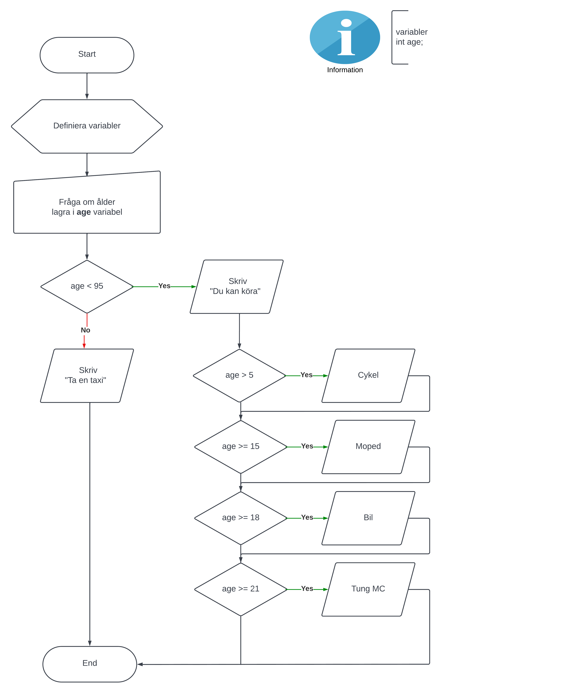

# Programbeskrivning
Frågar om ålder och talar om vad man får köra.

## Förklaringar
+ Vi definierar **age** variabeln först så att den ska finnas tillgänglig för alla delar av programmet

## Att fundera på
+ Om åldern är mindre än 5, vad händer då?
+ Om användaren skriver "Tjugo" iställer för 20, vad händer då?

## Exempelkörning
```
Hur gammal är du?
21
Du kan köra:
* Cykel
* Moped
* Bil
* Tung mc
```

## Pseudokod
```
Sätt heltal "age" till 0 som standardvärde

FRÅGA "Hur gammal är du?"
	lagra svaret i age variabeln

OM age < 95
	Skriv "Du får köra"
	om age> 5 skriv "Cykel"
	om age >= 15 skriv "Moped"
	om age >= 18 skriv "Bil"
	om age >= 21 skriv "Tung MC"
ANNARS
	Skriv "Ta en taxi"
```

## Flödesschema




