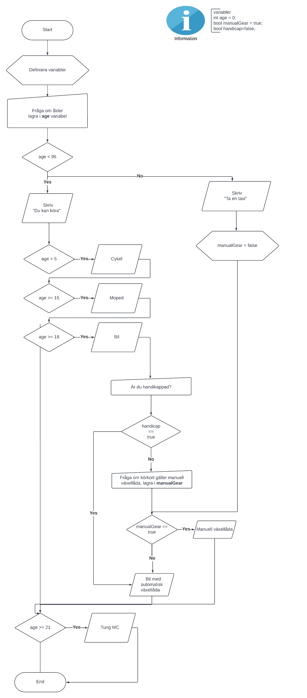

# Programbeskrivning
Frågar om ålder och talar om vad man får köra. Det är i stort 
sett likadant som det första exemplet, men här har vi ändrat
på if-satsen för att koden ska bli mer läsbart. Det anses god sed
enligt kod-gurun "Uncle Bob" att när man kör en if-sats med else 
så ska man alltid hantera "true" svaret först.

När vi nu ska kontrollera om vår användare har körkort för manuell 
växellåda måste vi fråga om det. Det är ingen poäng att fråga någon 
som kör cykel eller moped om de har körtkort för manuell växellåda, 
alltså frågar vi bara om personen har godkänd ålder för bil.

```cs
if (age >= 18)
{
	// Fråga om körkortstyp
}
```

Detta gör självklart att koden blir betydligt längre och mer komplex.

*För mer information om kodkomplexitet, se [How to know the Time Complexity of an Algorithm?
](https://www.lancaster.ac.uk/stor-i-student-sites/lidia-andre/2021/04/27/time-complexity-whats-that/), men tänk på att detta är överkurs.*

## Förklaringar
+ Vi definierar **age** variabeln först så att den ska finnas tillgänglig för alla delar av programmet
+ If-satsen är lite snyggare i den här versionen
+ Gällande komplexitet. För varje väg ett program kan gå, ökar komplexiteten.
  + Om programmet har ingen if-sats blir komplexiteten 1, då allt sker linjärt
  + Om programmet har en if-sats blir komplexiteten 2 då det finns två vägar för den. 
  + Om programmet har två if-satser eller en else if blir komplexiteten 3 då det finns tre vägar för den. 
  + Om if-satserna går in i varandra ökar komplexiteten mer
  + Detta program har komplexitet 12 (if else och if-satser i if-satsen) vilket visar hur lätt ett program kan tappa sin enkelhet och bli ett kod-monster.

## Att fundera på
+ Om åldern är mindre än 5, vad händer då?
+ Om användaren skriver "Tjugo" iställer för 20, vad händer då?
+ Programmet borde visa aktomatisk växellåda vare sig man har manuell växellåda eller inte. Kan du fixa det?.
+ Kan man göra programmet mindre komplicerad, men med samma funktionaltitet?

## Exempelkörning
```
Hur gammal är du?
21
Du kan köra:
* Cykel
* Moped
Är du handikappad? (J/N)
n
Har du körkort för manuell växellåda?(J/N)
j
* Bil med manuell växellåda
* Tung mc
```

## Pseudokod
```
Sätt heltal "age" till 0 som standardvärde

FRÅGA "Hur gammal är du?"
	lagra svaret i age variabeln

OM age >= 95
	Skriv "Ta en taxi"
ANNARS
	Skriv "Du får köra"
	om age> 5 skriv "Cykel"
	om age >= 15 skriv "Moped"
	om age >= 18 
	Skriv "Bil"
		Fråga "Är du handikappad?"
		Lagra svaret i handicap variabeln
		
		OM handicap == true 
			Sätt manualGear = true
		ANNARS
			Fråga "Vad har du för körkortstyp"
			Lagra svaret i manualGear

		OM manualGear == true
			Skriv "Bil (manuell)"
		ANNARS
			Skriv "Bil (automat)"

	om age >= 21 skriv "Tung MC"
```

## Flödesschema




